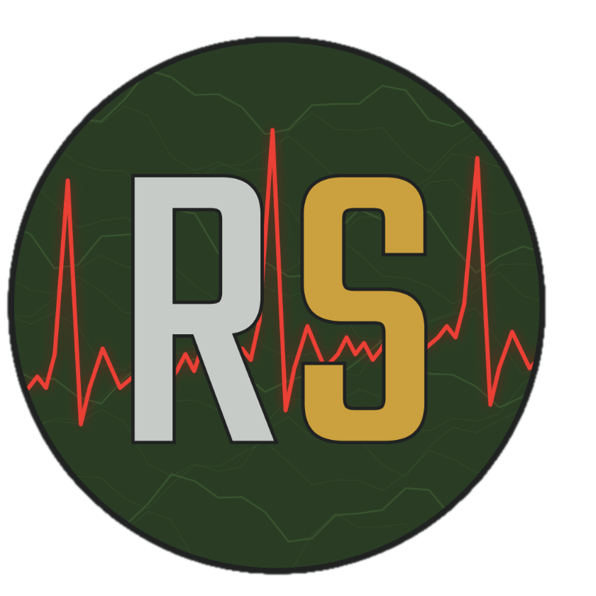

# Rugged SystEMS

<p align="center">
	
</p>

Rugged SystEMS is a Flutter-based offline rural EMS navigation and response demo built with ArcGIS Maps SDK for Flutter. The app simulates a dispatch-to-patient-to-hospital workflow with a tactical UI and profile-driven telemetry.

## Highlights

- Offline map loading from bundled .mmpk assets
- Login flow with operator-specific demo scenarios
- Dispatch alert and Current Dispatch full-screen overlay
- Route segmentation across paved, offroad, and walking phases
- Live-style telemetry panels by navigation phase
- Patient secured workflow and transition to hospital routing mode

## Tech Stack

- Flutter 3 / Dart 3
- ArcGIS Maps SDK for Flutter (`arcgis_maps`)
- Material 3 UI

## Project Structure

- `lib/main.dart`: App entry point and route setup
- `lib/login.dart`: Login screen and handoff to navigation page
- `lib/map.dart`: Main map page and EMS workflow state machine
- `lib/widgets/`: Tactical UI components (dispatch, phases, telemetry, overlays)
- `lib/utils/consts.dart`: Demo incident profiles and route segment definitions
- `assets/icons/`: Branding assets including app/logo icon
- `assets/offline/`: Offline map package storage

## Getting Started

### 1) Prerequisites

- Flutter SDK installed
- A connected emulator/device

Verify Flutter installation:

```bash
flutter --version
flutter doctor
```

### 2) Install dependencies

```bash
flutter pub get
```

### 3) Add your offline map package

Place at least one `.mmpk` file in:

`assets/offline/`

The app scans this folder at runtime and loads the first `.mmpk` it finds.

Note: `.mmpk` files are intentionally ignored by git in this project to avoid pushing large binaries.

### 4) Run the app

```bash
flutter run
```

## Workflow Overview

1. Login and enter the offline map view.
2. Receive and accept incoming dispatch.
3. Start road navigation and advance through route phases.
4. Mark patient reached to switch into secured-patient mode.
5. Continue to hospital routing panel.

## Theming

Current tactical palette baseline:

- Forest Green: `#1E3B1B`
- Gold Yellow: `#D4A017`
- Alert Red: `#E53935`
- Light Gray: `#C8CCCC`

## Launcher Icon

This project is configured with `flutter_launcher_icons` using:

- `assets/icons/RS_logo.png`

To regenerate icons:

```bash
dart run flutter_launcher_icons
```

## Notes

- This repository is configured as a demo/prototype experience.
- Route solving and route tracker wiring are scaffolded in `map.dart` and can be connected to a local transportation network from the loaded MMPK.
