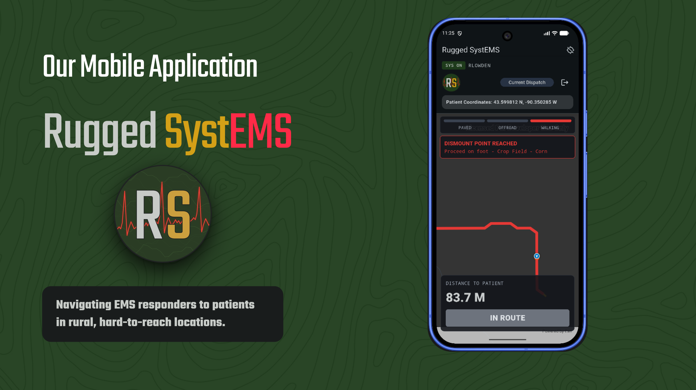
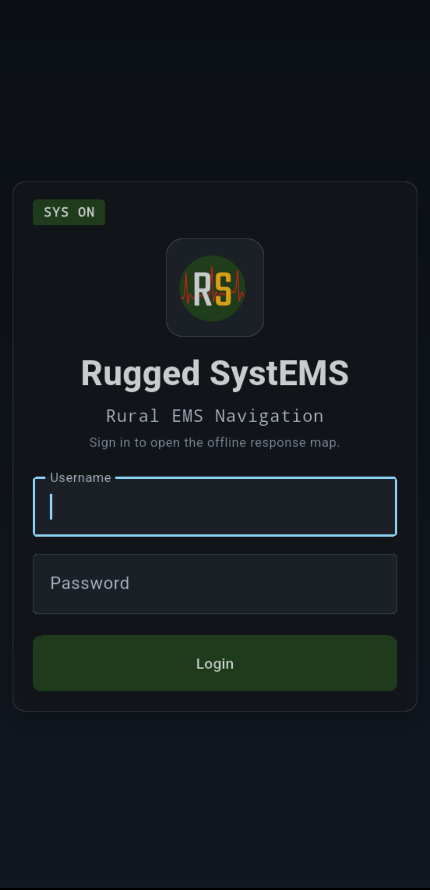
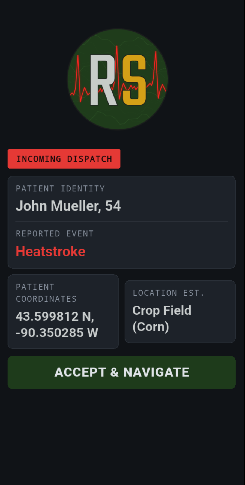
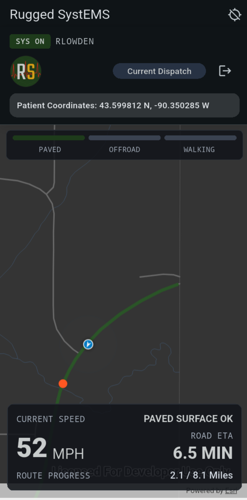
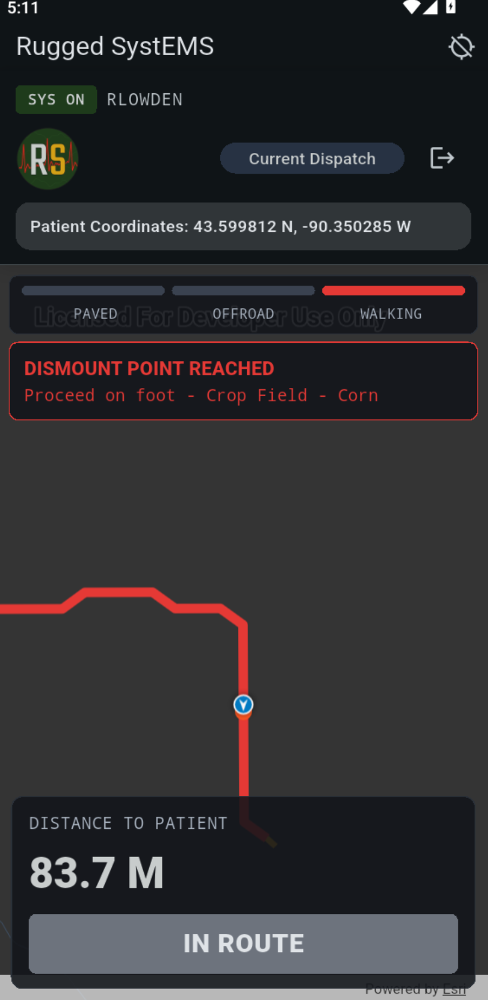
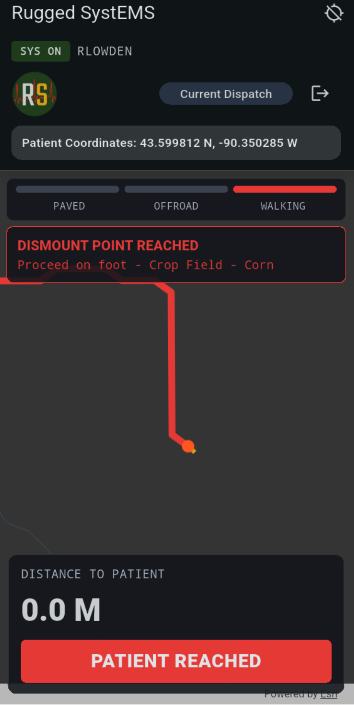
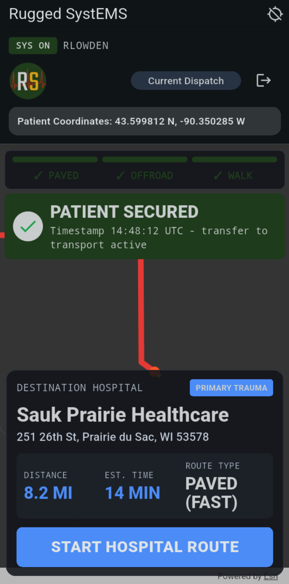

# Rugged SystEMS



Rugged SystEMS is a terrain-aware, offline navigation prototype designed for rural emergency response. It supports a two-stage rescue workflow: drive as close as possible, then continue on foot using terrain-informed routing.

## Inspiration

- Rural EMS response often requires leaving the vehicle and navigating on foot.
- The final stretch can be delayed by steep slopes, rivers, rough ground, and limited connectivity.
- Our goal was to explore how offline, terrain-aware routing could help responders reach patients faster and more safely.

## What It Does

- Loads an offline ArcGIS map package (`.mmpk`) from local assets.
- Simulates an EMS dispatch flow from call acceptance to patient reach and hospital handoff.
- Combines on-road navigation with off-road least-cost path routing.
- Displays live route progress and ETA during navigation.
- Works without internet once required map/data files are on device.

## Screenshots

<table>
  <tr>
    <td align="center">
      <br />
      <sub><b>Login</b></sub>
    </td>
    <td align="center">
      <br />
      <sub><b>Incoming Dispatch</b></sub>
    </td>
    <td align="center">
      <br />
      <sub><b>Paved Route</b></sub>
    </td>
  </tr>
  <tr>
    <td align="center">
      <br />
      <sub><b>Walking Route</b></sub>
    </td>
    <td align="center">
      <br />
      <sub><b>Patient Reached</b></sub>
    </td>
    <td align="center">
      <br />
      <sub><b>Patient Secured</b></sub>
    </td>
  </tr>
</table>

## How We Built It

- Collected Wisconsin GIS data (roads, rivers, and LiDAR-derived terrain layers).
- Processed and prepared data in ArcGIS Pro for a Vernon County study area.
- Built a terrain cost surface where harder terrain carries higher travel cost.
- Implemented least-cost path logic in Flutter/Dart to support off-road routing on mobile.
- Integrated routing and simulation UI into a single offline-first app experience.

## Challenges

- Running terrain-based least-cost routing efficiently on mobile.
- Implementing routing logic in Flutter without native geospatial analyst tooling.
- Balancing terrain factors into practical travel-cost weights.
- Keeping route progress and ETA behavior intuitive across paved, off-road, and walking phases.

## Accomplishments

- Built a Flutter mobile prototype that runs route workflows offline.
- Connected GIS terrain modeling to an interactive EMS navigation experience.
- Implemented combined paved and terrain-aware off-road routing.
- Delivered a realistic tactical UI for dispatch and field navigation phases.

## What We Learned

- Cross-discipline collaboration (GIS, software, design, business) improves solution quality.
- Cost-surface modeling is as much about domain context as technical implementation.
- Offline UX requires careful planning for data packaging, runtime behavior, and fallbacks.

## What's Next

- Expand beyond Vernon County to additional rural regions.
- Add EMS-relevant layers such as gates, culverts, flood risk, weather, and hazards.
- Refine travel-cost calibration with responder feedback and field validation.
- Improve operational tooling around reliability, performance, and deployment.

## Tech Stack

- Flutter
- Dart
- ArcGIS Maps SDK for Flutter (`arcgis_maps`)
- ArcGIS Pro

## Project Structure

- `lib/main.dart` - app entry and route setup
- `lib/login.dart` - login flow
- `lib/app.dart` - primary navigation workflow and state management
- `lib/map.dart` - alternate/legacy map workflow
- `lib/widgets/` - tactical UI components
- `lib/utils/consts.dart` - demo profiles and configuration constants
- `assets/offline/` - offline map package files

## Getting Started

### Prerequisites

- Flutter SDK installed
- iOS simulator, Android emulator, or physical device

### Install

```bash
flutter pub get
```

### Add Offline Map

- Place at least one `.mmpk` file in `assets/offline/`.
- Ensure `pubspec.yaml` includes your offline asset path.

### Run

```bash
flutter run
```

## Sources

- [Vernon County, WI - GIS Map & Land Records](https://www.vernoncountywi.gov/departments/land_information/gis.php)
- [GeoData@Wisconsin](https://geodata.wisc.edu/)
- [Shawano Ambulance Service](https://www.shawanoambulance.com/)
- [Flutter Documentation](https://docs.flutter.dev/)
- [ArcGIS Maps SDK for Flutter](https://developers.arcgis.com/flutter/)


